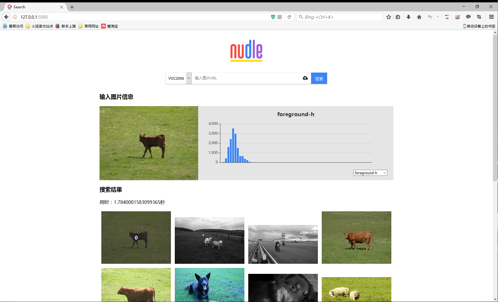
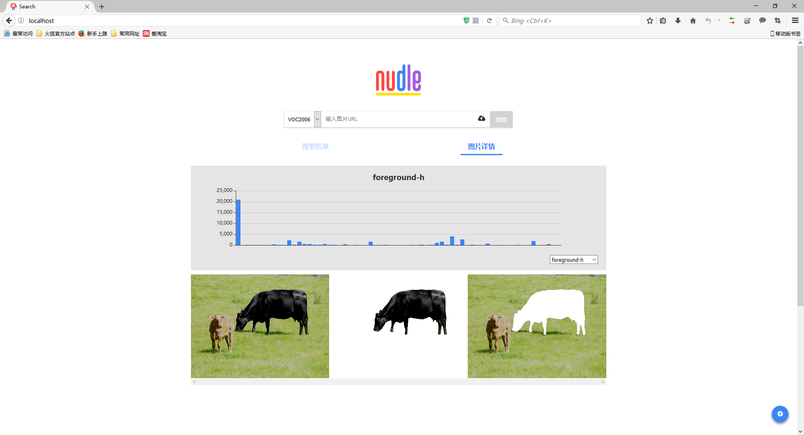

## Content Base Image Retrieval Platform

## DEMO






## 说明

项目分三个部分：

*   `Saliency`: CPP项目，用于编译出`Saliency RC cut`的动态链接库。代码来源于[CmCode](https://github.com/MingMingCheng/CmCode)
*   `front`: 前端项目，使用`React.js`实现
*   `server`: python项目，使用`Flask`与`OpenCV`

## 基本环境安装

> 目前只在Windows下运行过
>
> 各个项目的运行方式在各个项目下的`README.md`中查看

### Python

1. 下载并安装[Python 3.6 (64 bit)](https://www.python.org/downloads/)
2. 在环境变量中新建`PYTHON_DIR`，值为python的安装目录
3. 在`PATH`中添加`%PYTHON_DIR%`和`%PYTHON_DIR%\Scripts`
4. 将`pip`切换到豆瓣源
5. 使用`pip install <package_name>`指令依次安装第三方依赖
   1. `flask`
   2. `flask-cors`
   3. `pymongo`
   4. `pyparsing`
6. 以下依赖建议通过`whl`依次进行安装
   1. [numpy+mkl](http://www.lfd.uci.edu/~gohlke/pythonlibs/#numpy)
   2. [matplotlib](http://www.lfd.uci.edu/~gohlke/pythonlibs/#matplotlib)
   3. [scipy](http://www.lfd.uci.edu/~gohlke/pythonlibs/#scipy)
   4. [scikit-image](http://www.lfd.uci.edu/~gohlke/pythonlibs/#scikit-image)
   5. [opencv+contrib](http://www.lfd.uci.edu/~gohlke/pythonlibs/#opencv)
   6. [tornado](http://www.lfd.uci.edu/~gohlke/pythonlibs/#tornado)
   7. [pycurl](http://www.lfd.uci.edu/~gohlke/pythonlibs/#pycurl)

> 建议版本为[requirement.txt](./server/requirements.txt)中的版本或更高

### OpenCV

1. 下载并解压[OpenCV 3.2](https://sourceforge.net/projects/opencvlibrary/)
2. 在环境变量中新建`OPENCV_DIR`，值为OpenCV解压的目录
3. 在`PATH`中添加`%OPENCV_DIR%\build\x64\vc14\bin`

### Boost

1. 安装`Visual Studio 2015`
2. 下载并解压[Boost 1.63.0](https://sourceforge.net/projects/boost/files/boost/1.63.0/)
3. 用VS自带的`VS2015 x64 本机工具命令提示符`编译Boost
```
$ cd /d <Boost dir>
$ bootstrap.bat
```
4. 用文本编辑器打开生成的`project-config.jam`，在末尾添加
```
using python : 3.6 : <Python dir> : <Python dir>/include : <Python dir>/libs ;
```
5. 开始编译Boost
```
$ bjam.exe toolset=msvc-14.0 address-model=64 --prefix=<Boost dir>/build --build-type=complete --with-python install
```
6. 将生成的`build/lib`文件夹移动到`<Boost dir>/lib`，之后可以删除`build`文件夹以及上一步生成的`bin.v2`文件夹
7. 在环境变量中新建`BOOST_DIR`，值为Boost解压的目录
8. 在`PATH`中添加`%BOOST_DIR%`和`%BOOST_DIR%\lib`

### MongoDB

1. 下载并安装[MongoDB](https://www.mongodb.com/download-center#community)
1. 安装MongoDB服务
```
mongod --dbpath <MongoDB data path> --logpath <MongoDB data path>\mongo.log --logappend --serviceName MongoDB --serviceDisplayName MongoDB  --install
```
其中的`<MongoDB data path>`为自定的路径，用于存放数据以及log

### Node.js

1. 下载并安装[Node.js 最新版本](https://nodejs.org/en/download/)
2. 执行以下命令
```
$ npm config set registry https://registry.npm.taobao.org 
$ npm i -g babel-core babel-cli yarn webpack webpack-dev-server
```

### Nginx（可选）

1. 下载并安装[Nginx](http://nginx.org/en/download.html)
1. 打开`<Nginx path>/conf/nginx.conf`，修改配置
```
server {
    listen 80;                                      # 可修改为其他端口     
    server_name cbir;
    charset utf-8;
    
    location ~* /static/.+\.(jpe?g|png|ico)$ {
        alias   <Server code path>/static;          # 静态图片路径
        gzip    on;
        expires 30d;
    }
    
    location ~* /static/.+\.js$ {
        alias   <Server code path>/static;          # 脚本文件路径
        gzip    on;
        expires 7d;
    }

    location / {
        proxy_pass http://localhost:<Python port>;           # Python port 为自定端口，默认5000
        proxy_set_header X-Real-IP $remote_addr;
        proxy_pass_header Set-Cookie;
    }
}
```
